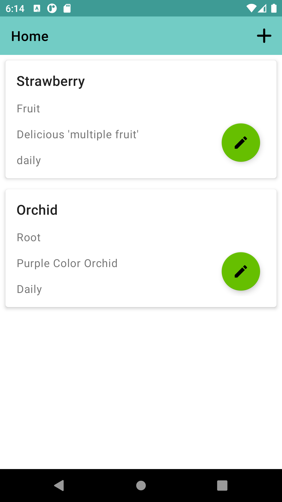

# Water Me App

Kode ini berdasarkan dari
codelab [Google (Water Me App)](https://developer.android.com/codelabs/basic-android-kotlin-training-project-water-me "Link Asal")

## Tampilan

Aplikasi ini terbagi menjadi 2 tampilan:

1. Tampilan Beranda  
   
2. Tampilan tambah/edit data  
   

## Data Tumbuhan

Data untuk tumbuhan terbagi menjadi 5:

1. ID - Data ini digunakan sebagai primary key dari tanaman tersebut, data ini tidak akan
   ditampilkan ke pengguna
2. Name - Data ini merupakan nama dari tumbuhan tersebut
3. Type - Data ini menampilkan berupa tipe dari tanaman kalian, untuk pembatasan input belum
   ditentukan karena itu pengguna yang memasukkan sesuai kategori yang diinginkan
4. Schedule - Data ini merupakan waktu penyiraman, ditetapkan daily, weekly, dan monthly.
5. Description - Data ini menampilkan deskripi dari tanaman kalian

## Fitur yang akan ditambahkan

1. Filter di Beranda
2. Gambar untuk tumbuhan
3. Menghubungkan dengan pengguna lain